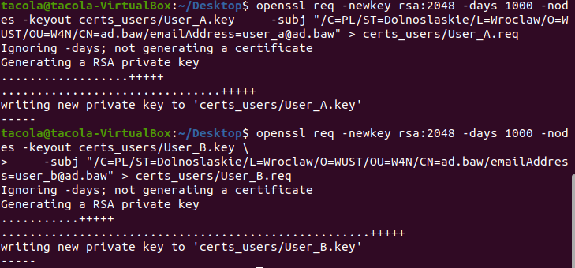
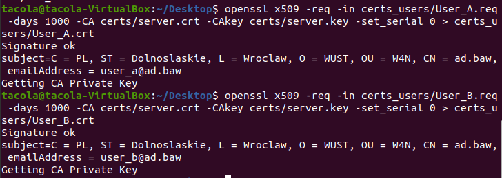
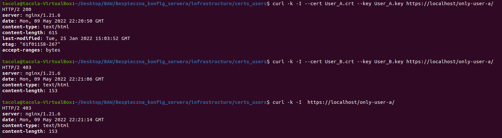
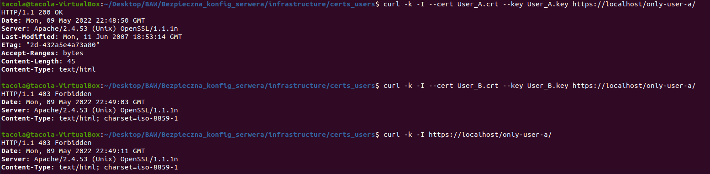
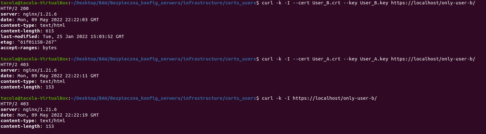
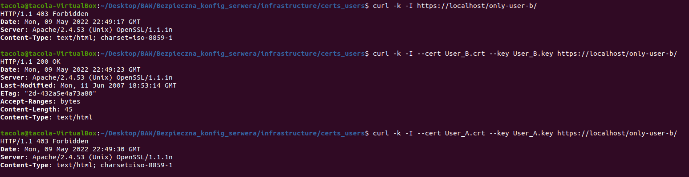
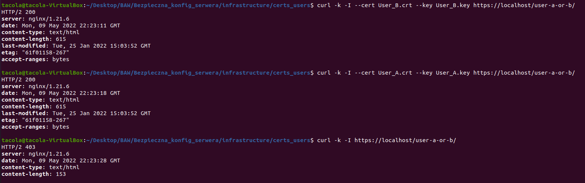
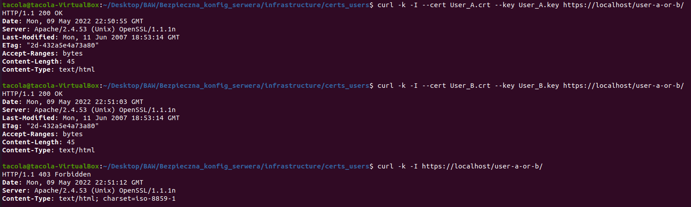

<p align="center">
    
    <h1 align="center">Bezpieczna konfiguracja serwera webowego - zadanie 2</h1>
    <h3 align="center">Bezpieczeństwo aplikacji webowych (projekt)</h3>
    <h3 align="center">piątek 8:15</h3>
</p>

---

Wykonano raport bezpiecznej konfiguracji serwera webowego. Uwzględniono w nim konfigurację dla serwerów Nginx oraz Apache. Zadanie wykonano w oparciu o środowisko Docker. W [Readme](../Bezpieczna_konfig_serwera/infrastructure/Readme.md) opublikowano instrukcję uruchomienia serwerów Nginx i Apache z DockerFile.

## Generowanie dwóch certyfikatów klienckich (User_A i User_B) dla certyfikatu serwera

Podobnie jak w pierwszym raporcie wygenerowano przy pomocy `openssl` certyfikaty klienckie.
Najpierw wygenerowano klucz, następnie request o utworzenie ceryfikatu klienckiego. Utworzono certyfikat na bazie klucza oraz requestu, zakładając, że Certificate Authority to certyfikat serwera - `server.crt`

Utworzenie certyfikatu User_A:
```
openssl req -newkey rsa:2048 -days 1000 -nodes -keyout certs_users/User_A.key \
    -subj "/C=PL/ST=Dolnoslaskie/L=Wroclaw/O=WUST/OU=W4N/CN=ad.baw/emailAddress=user_a@ad.baw" > certs_users/User_A.req
openssl x509 -req -in certs_users/User_A.req -days 1000 -CA certs/server.crt -CAkey certs/server.key -set_serial 0 > certs_users/User_A.crt
```

Utworzenie certyfikatu User_B:
```
openssl req -newkey rsa:2048 -days 1000 -nodes -keyout certs_users/User_B.key \
    -subj "/C=PL/ST=Dolnoslaskie/L=Wroclaw/O=WUST/OU=W4N/CN=ad.baw/emailAddress=user_b@ad.baw" > certs_users/User_B.req

openssl x509 -req -in certs_users/User_B.req -days 1000 -CA certs/server.crt -CAkey certs/server.key -set_serial 0 > certs_users/User_B.crt
```




## Ustawienia globlane dla obługiwania certyfikatów

Aby działać na większej liczbie certyfikatów niż jeden, w Nginx oraz Apache utworzono łańcuch certyfikatów z utworzonych certyfikatów User_A i User_B w jednym pliku. Ze względu na błędy w kopiowaniu przez DockerFile certyfikatów do jednego pliku (brakowało znaków nowej linii), ręcznie połączono pliki certyfikatów i dodano do DockerFile - plik `clients.crt`.

### Nginx

Linie w DockerFile
```
RUN mkdir /etc/nginx/client_certs

COPY clients.crt  /etc/nginx/client_certs/clients.crt
```

Dla Nginx w pliku `ssl.conf` dodano ścieżkę do połączonych w jeden plik certyfikatów klienckich oraz uruchomiono opcjonalne weryfikowanie certyfikatów na serwerze, aby można było również wejść na pozostałe ścieżki bez certyfikatów.
```
ssl_client_certificate  /etc/nginx/client_certs/clients.crt;
ssl_verify_client optional;
```
### Apache

Linie w Dockerfile:
```
RUN mkdir /usr/local/apache2/conf/client_certs

COPY certs/clients.crt /usr/local/apache2/conf/client_certs/clients.crt
```

W ramach Apache dla pliku `httpd-ssl.conf` dodano aliasy dla każdej nowej ścieżki, aby wyświetlana była domyślna strona.

```bash
AliasMatch ^/only\-user\-a\/*(.*) /usr/local/apache2/htdocs/index.html
AliasMatch ^/only\-user\-b\/*(.*) /usr/local/apache2/htdocs/index.html
AliasMatch ^/user\-a\-or\-b\/*(.*) /usr/local/apache2/htdocs/index.html
```

Dodatkowo, podobnie jak w Nginx - dodano rozpoznawanie certyfikatów i ich opcjonalne rozpatrywanie.
```
SSLVerifyClient optional
SSLCACertificateFile /usr/local/apache2/conf/client_certs/clients.crt
```

## Ustawienie ścieżki `/only-user-a` i dalszych podścieżek - dostęp do ścieżki tylko dla klientów z certyfikatem User A

### Nginx

W pliku `locations.conf` stworzono zasadę dostępu do `/only-user-a` i jej podścieżek w następujący sposób:
```
location /only-user-a {
    if ($ssl_client_verify != "SUCCESS") { return 403; }
    if ($ssl_client_s_dn !~ "emailAddress=user_a@ad.baw") { return 403; }

    try_files $uri $uri/ /index.html;

    alias    /usr/share/nginx/html/;
}
```
Weryfikowana jest obecność znanego przez serwer certyfikatu oraz pola email w SDN - rozróżnia on użytkowników A i B między sobą. Wykorzystano ku temu wyrażenie regularne.

Przetestowano działanie ustawień poprzez zapytanie curl:
```
curl -k -I --cert User_A.crt --key User_A.key https://localhost/only-user-a/
curl -k -I https://localhost/only-user-a/
curl -k -I --cert User_B.crt --key User_B.key https://localhost/only-user-a/
```



### Apache

Logika detekcji certyfikatu jest zaimplementowana podobnie jak w przypadku Nginx.

W pliku `httpd-ssl.conf` dodano ustawienia dla ścieżki `/only-user-a` i jej podścieżek, aby wykrywać certyfikat użytkownika.

```bash
    <Location /only-user-a>
        <RequireAll>
            Require ssl-verify-client
            Require expr "%{SSL_CLIENT_S_DN} =~ m#user_a\@ad\.baw#"
        </RequireAll>
    </Location>
```
Przetestowano działanie ustawień poprzez zapytanie curl:
```
curl -k -I --cert User_A.crt --key User_A.key https://localhost/only-user-a/
curl -k -I https://localhost/only-user-a/
curl -k -I --cert User_B.crt --key User_B.key https://localhost/only-user-a/
```




## Ustawienie ścieżki `/only-user-b` i dalszych podścieżek - dostęp do ścieżki tylko dla klientów z certyfikatem User B

### Nginx

W pliku `locations.conf` stworzono zasadę dostępu do `/only-user-b` i jej podścieżek w następujący sposób:
```
location /only-user-b {
    if ($ssl_client_verify != "SUCCESS") { return 403; }
    if ($ssl_client_s_dn !~ "emailAddress=user_b@ad.baw") { return 403; }

    try_files $uri $uri/ /index.html;

    alias    /usr/share/nginx/html/;
}
```
Jest ona identyczna jak dla przykładu z certyfikatem dla użytkownika User_A.

Przetestowano działanie ustawień poprzez zapytanie curl:
```
curl -k  -I --cert User_B.crt --key User_B.key https://localhost/only-user-b/
curl -k  -I --cert User_A.crt --key User_A.key https://localhost/only-user-b/
curl -k  -I https://localhost/only-user-b/
```



### Apache

W pliku `httpd-ssl.conf` dodano ustawienia dla ścieżki `/only-user-b` i jej podścieżek, aby wykrywać certyfikat użytkownika.

```bash
    <Location /only-user-b>
        <RequireAll>
            Require ssl-verify-client
            Require expr "%{SSL_CLIENT_S_DN} =~ m#user_b\@ad\.baw#"
        </RequireAll>
    </Location>
```

Przetestowano działanie ustawień poprzez zapytanie curl:
```
curl -k -I --cert User_A.crt --key User_A.key https://localhost/only-user-b/
curl -k -I https://localhost/only-user-b/
curl -k -I --cert User_B.crt --key User_B.key https://localhost/only-user-b/
```




## Ustawienie ścieżki `/user-a-or-b` i dalszych podścieżek - dostęp do ścieżki tylko dla klientów z certyfikatem User A lub User B

### Nginx

W pliku `locations.conf` stworzono zasadę dostępu do `/user-a-or-b` i jej podścieżek w następujący sposób:
```
location /user-a-or-b {
    if ($ssl_client_verify != "SUCCESS") { return 403; }
    if ($ssl_client_s_dn !~ "(emailAddress=user_a@ad.baw)|(emailAddress=user_b@ad.baw)") { return 403; }

    try_files $uri $uri/ /index.html;

    alias    /usr/share/nginx/html/;
}
```
Jest ona połączeniem wcześniejszych przykładów - wykorzystano tutaj połączenie warunków przy pomocy "lub" `|` i wyrażenie regularne.

Przetestowano działanie ustawień poprzez zapytania curl:

```
curl -k  -I --cert User_B.crt --key User_B.key https://localhost/user-a-or-b/
curl -k  -I --cert User_A.crt --key User_A.key https://localhost/user-a-or-b/
curl -k  -I https://localhost/user-a-or-b/
```



### Apache

W pliku `httpd-ssl.conf` dodano ustawienia dla ścieżki `/user-a-or-b` i jej podścieżek, aby wykrywać certyfikat użytkownika.

```bash
    <Location /user-a-or-b>
        <RequireAll>
            Require ssl-verify-client
            Require expr "%{SSL_CLIENT_S_DN} =~ m#user_a\@ad\.baw# || %{SSL_CLIENT_S_DN} =~ m#user_b\@ad\.baw#"
        </RequireAll>
    </Location>
```
Przetestowano działanie ustawień poprzez zapytanie curl:
```
curl -k -I --cert User_A.crt --key User_A.key https://localhost/user-a-or-b/
curl -k -I https://localhost/user-a-or-b/
curl -k -I --cert User_B.crt --key User_B.key https://localhost/user-a-or-b/
```


