<p align="center">
    
    <h1 align="center">Zadanie rozgrzewkowe</h1>
    <h3 align="center">Bezpieczeństwo aplikacji webowych (projekt)</h3>
    <h3 align="center">piątek 8:15</h3>
</p>

---

W ramach pierwszego zadania projektowego wykonano raport przejścia gry programistycznej HackMe (wersji 1 oraz 2). Dla każdej z nich trzeba przejść formularz logowania - należy odgadnąć hasło na bazie dołączonych do kodu strony skryptów JS lub PHP.

## Hackme

Link do pierwszej części - https://uw-team.org/hackme/ 


### Poziom 1

Adres: https://uw-team.org/hackme/level1.htm 

Zrzut ekranu - widzimy na nim pole do logowania.

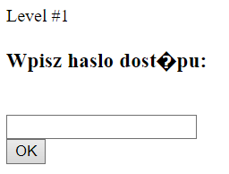

Przy pomocy skrótu klawiszowego `CTRL+U` można w szybki sposób podejrzeć kod źródłowy strony.

Zawartość strony:

```html

<HTML>
<script>
function sprawdz�(){
if (document.getElementById('haslo').value=='i am too lame') {self.location.href="zaq.htm";} else {alert('Zle haselko :)');}
}
</script>
<br>Level #1
<h3>Wpisz haslo dost�pu:</h3>
<br><input type="text" name="haslo" id="haslo">
<br><input type="button" value="OK" onClick="sprawdz()">
</HTML>

<script>
function sprawdz(){
if (document.getElementById('haslo').value=='a jednak umiem czytac') {self.location.href='ok_next.htm';} else {alert('Zle haselko :)');}
}
</script>

```

Poprzez kliknięcie przycisku OK wykonywana jest funkcja `sprawdz()`.
Jest ona zdefiniowana w dwóch miejscach - na początku oraz na końcu strony. Przeglądarki interpretują wpis html od góry do dołu, co za tym idzie przeglądarka "pamięta" ostatnie zadeklarowane skrypty, czyli umieszczone na końcu strony. 

Poprzez podanie hasła `a jednak umiem czytac` przechodzimy do drugiego poziomu.

### Poziom 2

Adres: https://uw-team.org/hackme/ok_next.htm

Zrzut ekranu - widzimy na nim pole do logowania.

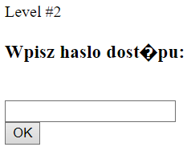

Przy pomocy skrótu klawiszowego `CTRL+U` można w szybki sposób podejrzeć kod źródłowy strony.

Zawartość strony:

```html

<HTML>
<script src="haselko.js"></script>
<script>
function sprawdz(){
if (document.getElementById('haslo').value==has) {self.location.href=adresik;} else {alert('Nie... to nie to haslo...');}
}
</script>
<br>Level #2
<h3>Wpisz haslo dost�pu:</h3>
<br><input type="text" name="haslo" id="haslo">
<br><input type="button" value="OK" onClick="sprawdz()">
</HTML>

```

Zawartość skryptu haselko.js:

```js
var has='to bylo za proste';
var adresik='formaster.htm';
```

W kodzie strony mamy odwołanie do skryptu JavaScript `haselko.js` oraz funkcji `sprawdz()`.
Funkcja `sprawdz()` oczekuje wartości przypisanej do zmiennej `has`, która znajduje się w skrypcie `haselko.js` - zawiera wartość `to bylo za proste`. Przy podaniu wartości zmiennej `has`, kliknięcie OK przekieruje nas na podstronę `formaster.htm` - do poziomu 3.

### Poziom 3

Adres: https://uw-team.org/hackme/formaster.htm

Zrzut ekranu - widzimy na nim pole do logowania.

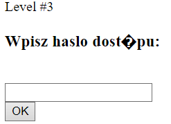

Przy pomocy skrótu klawiszowego `CTRL+U` można w szybki sposób podejrzeć kod źródłowy strony.

Zawartość strony:

```html
<HTML>
<script>
function right(e) {
if (navigator.appName == 'Netscape' && 
(e.which == 3 || e.which == 2))
return false;
else if (navigator.appName == 'Microsoft Internet Explorer' && 
(event.button == 2 || event.button == 3)) {
alert('Prawy nie dziala...');
return false;
}
return true;
}
var dod='unknow';
function prawy(txx){
var txt=txx;
document.onmousedown=right;
if (document.layers) window.captureEvents(Event.MOUSEDOWN);
window.onmousedown=right;
}
prawy();
var literki='abcdefgh';
var ost='';
function losuj(){
ost=literki.substring(2,4)+'qwe'+dod.substring(3,6);
}

function sprawdz(){
losuj();
if (document.getElementById('haslo').value==ost) {self.location.href=ost+'.htm';} else {alert('Nie... to nie to haselko...');}
}
</script>
<br>Level #3
<h3>Wpisz haslo dost�pu:</h3>
<br><input type="text" name="haslo" id="haslo">
<br><input type="button" value="OK" onClick="sprawdz()">
</HTML>

```

Do przycisku OK przypisano wykonanie funkcji `sprawdz()`. 

```js
function sprawdz(){
losuj();
if (document.getElementById('haslo').value==ost) {self.location.href=ost+'.htm';} else {alert('Nie... to nie to haselko...');}
}
```

Funkcja `sprawdz()` odwołuje się do wyniku wykonania funkcji `losuj()`. Porównuje ona wpisane hasło do wartości zmiennej `ost`, a po poprawnym podaniu hasła przekierowuje do strony `ost.htm`.

 W funkcji `losuj()` mamy wykorzystane 2 zmienne - `literki` oraz `ost`. Wykonanie funkcji `losuj()` przypisuje wartość do zmiennej `ost`.
 
 Najważniejszy wycinek kodu:

```js
var dod = 'unknow';
var literki='abcdefgh';
var ost='';
function losuj(){
ost=literki.substring(2,4)+'qwe'+dod.substring(3,6);

```
W zmiennej `ost` występuje łączenie łańcuchów znaków w jeden (znaki +).

Metoda `substring(X,Y)` zwraca ciąg znaków od miejsca w pozycji `X` do znaku w pozycji `Y-1`. Należy pamiętać, że łańcuch znaków w JS zaczyna się od wartości 0.

Czyli dla wywołania `literki.substring(2,4)` otrzymujemy wynik `cd`.
W przypadku `dod.substring(3,6)` - `now`.

Razem - `ost = 'cdqwenow'`

Podajac wartość `ost` do formularza zostajemy przekierowani do następnego poziomu.

### Poziom 4

Adres: https://uw-team.org/hackme/formaster.htm

Zrzut ekranu - widzimy na nim lekko odmienne od poprzednich, ale dalej pole do logowania.

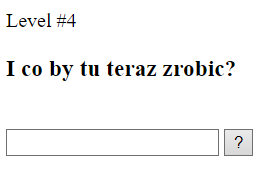

Przy pomocy skrótu klawiszowego `CTRL+U` można w szybki sposób podejrzeć kod źródłowy strony.

Zawartość strony:

```html
<HTML>
<script>
function sprawdz(){
zaq=document.getElementById('haslo').value;
if (isNaN(zaq)) {alert('Zle haslo!')} else {
wynik=(Math.round(6%2)*(258456/2))+(300/4)*2/3+121;
if (zaq==wynik) {self.location.href='go'+wynik+'.htm';} else {alert('Zle haslo!')}
}}
</script>
<br>Level #4
<h3>I co by tu teraz zrobic?</h3>
<br><input type="text" name="haslo" id="haslo" size=20>&nbsp<input type="button" value="?" onClick="sprawdz()">
</HTML>
```

Analogicznie do poprzednich poziomów przy podaniu hasła mamy wywołanie funkcji `sprawdz()`.

W tym przypadku jest weryfikowana zawartość pola `haslo` (zmienna `zaq`) - jeśli nic nie zostaje podane, zwracany jest alert - `'Zle haslo!'`. W przeciwnym wypadku mamy do rozwiązania zadania matematyczne:

```js
wynik=(Math.round(6%2)*(258456/2))+(300/4)*2/3+121;
if (zaq==wynik) {self.location.href='go'+wynik+'.htm';} else {alert('Zle haslo!')}
```

Zadanie matematyczne składa się z:
 - Operacji modulo (znak `%`)
 - Operacji zaokrąglania całkowitego w góre (`Math.round()`)
 - Podstawowego mnożenia (znak `*`), dzielenia (znak `/`), dodawania (znak `+`)

 Należy pamiętać o kolejności wykonywania działań, które są tutaj określone poprzez nawiasy.

 Kolejne kroki uproszczenia równania:
 - `(Math.round(6%2)*(258456/2))+(300/4)*2/3+121`
 - `(Math.round(0)*(129228))+(75)*2/3+121`
 - `0 + 150/3 + 121`
 - `171`

 Wynikiem jest liczba `171` i wpisana jako hasło pozwala przejść do następnego etapu.

### Poziom 5 

Adres: https://uw-team.org/hackme/go171.htm

Zrzut ekranu - widzimy na nim zamek czasowy

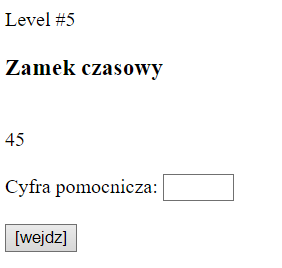

Przy pomocy skrótu klawiszowego `CTRL+U` można w szybki sposób podejrzeć kod źródłowy strony.

Zawartość strony:

```html

<HTML>
<script>
var now = new Date();
var seconds = now.getSeconds();

function czas(){
now = new Date();
seconds = now.getSeconds();
txt.innerHTML=seconds;
setTimeout('czas()',1);
}

function sprawdz(){
ile=((seconds*(seconds-1))/2)*(document.getElementById('pomoc').value%2);
if (ile==861) {self.location.href=seconds+'x.htm'} else {alert('Zle haslo!');}
}
</script>
<br>Level #5
<h3>Zamek czasowy</h3>
<br><div id="txt">?</div>
<br>Cyfra pomocnicza: <input type="text" size=3 name="pomoc" id="pomoc"><br>
<br><input type="button" value="[wejdz]" onClick="sprawdz()">
<script>czas();</script>
</HTML>
```

Aby przejść do następnego poziomu należy wpisać w odpowiednim momencie hasło - określone w warunku `if`:

```js
if (ile==861) {self.location.href=seconds+'x.htm'} else {alert('Zle haslo!');
```

Rozwiązanie znajduje się w tej linijce:

```js
ile=((seconds*(seconds-1))/2)*(document.getElementById('pomoc').value%2);
```

Zmienna `seconds` to obecna liczba sekund (z zakresu 0-59), a `(document.getElementById('pomoc').value%2)` to wartość wpisana przez użytkownika w dostępne pole, dla której jest wykonana operacja modulo. Przekazywana przez nas liczba musi być nieparzysta, aby uniknąć wyzerowania równania. Dla modulo z 2 dla liczb nieparzystych to zawsze będzie wartość 1.

Dlatego najważniejszą częścią zmiennej `ile` jest operacja na zmiennej `seconds`. Należy wprowadzić w pole `pomoc` obojętną liczbę nieparzystą, ale w odpowiednim czasie. Aby ustalić ten czas należy rozwiązać poniższe równanie kwadratowe, które pozwoli nam stwierdzić, w której sekundzie należy kliknąć przycisk `[wejdz]`.

```js
861 == (seconds*(seconds-1))/2)
2*861 == (seconds*(seconds-1))

1722 == seconds*(seconds-1)
seconds zawiera się w (0,59)
seconds^2 - seconds - 1722 == 0
```

Rozwiązanie - https://www.wolframalpha.com/input?i=x%5E2+-+x+-+1722+%3D+0 

Z tego wynika, że należy kliknąć przycisk `[wejdz]` w `42` sekundzie i zostajemy przekierowani dalej do poziomu 6.

### Poziom 6

Adres: https://uw-team.org/hackme/42x.htm

Zrzut ekranu - widzimy na nim pole do logowania.


Przy pomocy skrótu klawiszowego `CTRL+U` można w szybki sposób podejrzeć kod źródłowy strony.

Zawartość strony:

```html

<HTML>
<script>
var lit='abcdqepolsrc';
function sprawdz(){
var licznik=0;
var hsx='';
var znak='';
zaq=document.getElementById('haslo').value;
for (i=1; i<=5; i+=2){
licznik++;
if ((licznik%2)==0) {znak='_';} else {znak='x';}
hsx+=lit.substring(i,i+1)+znak;
}
hsx+=hsx.substring(hsx.length-3,hsx.length);
if (zaq==hsx) {self.location.href=hsx+'.htm';} else {alert('Zle haslo!');}
}
</script>
<br>Level #6
<h3>Wprowadz has�o:</h3>
<br><input type="text" name="haslo" id="haslo">
<br><input type="button" value="OK" onClick="sprawdz()">
</HTML>
```

W tym przypadku najważniejsza jest dla nas zmienna `hsx`. Jest ona na początku pustym łańcuchem znaków. Jej zawartość jest modyfikowana co każde wykonanie pętli `for`:

```js
//licznik = 0
//lit='abcdqepolsrc'
for (i=1; i<=5; i+=2){
licznik++;
if ((licznik%2)==0) {znak='_';} else {znak='x';}
hsx+=lit.substring(i,i+1)+znak;
}
```

Łącznie pętla wykona się dla wartości `i=1`, `i=3` i `i=5`, czyli trzy razy.

Wykonane działania dla `i=1`:

```js
licznik = 1 
licznik%2 = 1 // czyli znak ='x'
//do zmiennej hsx zostanie dodany ciąg ze zmiennej lit - metoda substring - czyli znak na 1 pozycji w ciągu ('b') oraz znak ze zmiennej znak 'x'
hsx = 'bx' 
```

Wykonane działania dla `i=3`:

```js
licznik = 2 
licznik%2 = 0 // czyli znak ='_'
// do zmiennej hsx zostanie dodany ciąg ze zmiennej lit - metoda substring - czyli znak na 3 pozycji w ciągu ('d') oraz znak ze zmiennej znak '_'
hsx = 'bxd_' 
```

Wykonane działania dla `i=5`:

```js
licznik = 3
licznik%2 = 1 //czyli znak ='x'
// do zmiennej hsx zostanie dodany ciąg ze zmiennej lit - metoda substring - czyli znak na 5 pozycji w ciągu ('e') oraz znak ze zmiennej znak 'x'
hsx = 'bxd_ex' 
```

Po przejściu pełnej iteracji pętli, zmienna `hsx` jest modyfikowana o dodanie do ciągu jej podciąg, również przy wykorzystaniu metody `substring()`:

```js
hsx+=hsx.substring(hsx.length-3,hsx.length);
```

`hsx.length` określa długość naszego wyjściowego ciągu - w tym przypadku wartość `hsx.length` wynosi 6.
Czyli w wyniku działania powyższej linii kodu dodajemy do końca łańcucha znaków ostatnie 3 znaki - `_ex`.

Ostatecznie zmienna - `hsx = 'bxd_ex_ex'`.

Po podaniu wartośći zmiennej `hsx` w polu formularza, przechodzimy do następnego poziomu.

### Poziom 7

Adres: https://uw-team.org/hackme/bxd_ex_ex.htm

Zrzut ekranu - widzimy na nim pole do logowania.

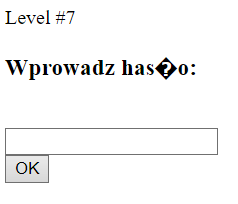

Przy pomocy skrótu klawiszowego `CTRL+U` można w szybki sposób podejrzeć kod źródłowy strony.

Zawartość strony:

```html
<HTML>
<script>
function sprawdz(){
zaq=document.getElementById('haslo').value;
wyn='';
for (i=0; i<=zaq.length-1; i++){
lx=zaq.charAt(i);
ly='';
if (lx=='a') {ly='z'}
if (lx=='b') {ly='y'}
if (lx=='c') {ly='x'}
if (lx=='d') {ly='w'}
if (lx=='e') {ly='v'}
if (lx=='f') {ly='u'}
if (lx=='g') {ly='t'}
if (lx=='h') {ly='s'}
if (lx=='i') {ly='r'}
if (lx=='j') {ly='q'}
if (lx=='k') {ly='p'}
if (lx=='l') {ly='o'}
if (lx=='m') {ly='n'}
if (lx=='n') {ly='m'}
if (lx=='o') {ly='l'}
if (lx=='p') {ly='k'}
if (lx=='q') {ly='j'}
if (lx=='r') {ly='i'}
if (lx=='s') {ly='h'}
if (lx=='t') {ly='g'}
if (lx=='u') {ly='f'}
if (lx=='v') {ly='e'}
if (lx=='w') {ly='d'}
if (lx=='x') {ly='c'}
if (lx=='y') {ly='b'}
if (lx=='z') {ly='a'}
if (lx==' ') {ly='_'}
wyn+=ly;
}
if (wyn=='plxszn_xrv') {self.location.href=wyn+'.htm';} else {alert('Zle haslo!');}
}
</script>
<br>Level #7
<h3>Wprowadz has�o:</h3>
<br><input type="text" name="haslo" id="haslo">
<br><input type="button" value="OK" onClick="sprawdz()">
</HTML>

```

W kodzie strony znajduje się implementacja szyfru podstawieniowego. Litery z przekazanego w formularzu ciągu znaków zostają zastąpione odpowiednią literą, określoną w warunku `if`. Np: litera `'o'` zastępowana jest literą `'l'`.

Aby przejść do dalszego poziomu należy zapisać w formularzu taki ciąg znaków, który zwróci po przejściu przez szyfr wartość zmiennej `wyn = 'plxszn_xrv'`.

Czyli należy wpisać zamienić poniższe litery: - 'kocham cie':
 - `k` <- `p`
 - `o` <- `l`
 - `c` <- `x`
 - `h` <- `s`
 - `a` <- `z`
 - `m` <- `n`
 - ` ` <- `_`
 - `c` <- `r`
 - `i` <- `r`
 - `e` <- `v`

### Poziom 8

Adres: http://www.uw-team.org/hackme/plxszn_xrv.htm

Zrzut ekranu - widzimy na nim pole do logowania.


Przy pomocy skrótu klawiszowego `CTRL+U` można w szybki sposób podejrzeć kod źródłowy strony.

Zawartość strony:

```html
<HTML>
<script>
var roz='dsabdkgsawqqqlsahdas'; 
var tmp=roz.substring(2,5)+roz.charAt(12);
document.write('<\s'+'c'+'r'+'i'+'p'+'t src="%7A%73%65%64%63%78%2E%6A%73"><\/s'+'c'+'r'+'i'+'p'+'t'+'>');

function sprawdz(){
zaq=document.getElementById('haslo').value; wyn=''; alf='qwertyuioplkjhgfdsazxcvbnm';
qet=0; for (i=0; i<=10; i+=2){
get+=10; wyn+=alf.charAt(qet+i); qet++;}
wyn+=eval(ax*bx*cx);
if (wyn==zaq) {self.location.href=wyn+'.htm';} else {alert('Zle haslo!');}
}
</script>

<br>Level #8
<h3>Wprowadz has�o:</h3>
<script src="%70%61%73%73%77%64.js"></script>
<br><input type="text" name="haslo" id="haslo">
<br><input type="button" value="OK" onClick="sprawdz()">
</HTML>
```

Pierwsze odwołanie do zmiennej `wyn`, któa pozwoli nam na uzyskanie hasła znajduje się tutaj:

```js
qet=0; for (i=0; i<=10; i+=2){
get+=10; wyn+=alf.charAt(qet+i); qet++;}
```

W pętli `for` do zmiennej `wyn` dodawane są znaki, zawarte w łańcuchu `alf` `alf='qwertyuioplkjhgfdsazxcvbnm'`. Pętla wykona się 6 razy dla `i` równego kolejno 0,2,4,6,8,10. Za każdym razem zmienna `qet` będzie zwiększona o 1.
Co każde przejście pętli będziemy pobierać ze zmiennej `alf` znaki z pozycji `qet+1` - metoda `charAt()`. 
Czyli dla:

 - `qet=0` - pobieramy 0 znak z ciągu `alf` - czyli `q`
 - `qet=3` - pobieramy 3 znak z ciągu `alf` - czyli `r`
 - `qet=6` - pobieramy 6 znak z ciągu `alf` - czyli `u`
 - `qet=9` - pobieramy 9 znak z ciągu `alf` - czyli `p`
 - `qet=12` - pobieramy 12 znak z ciągu `alf` - czyli `j`
 - `qet=15` - pobieramy 15 znak z ciągu `alf` - czyli `f`

Dodajemy te znaki kolejno do zmiennej `wyn` - po dodaniu wartość zmiennej `wyn` wynosi `qrupjf`.

Aby przejść dalej, należy jeszcze określić wynik tego działania:

```js
wyn+=eval(ax*bx*cx);
```

Jednakże w kodzie nie mamy zdefiniowanych zmiennych `ax`, `bx`, `cx`. 

W linii:

```js
document.write('<\s'+'c'+'r'+'i'+'p'+'t src="%7A%73%65%64%63%78%2E%6A%73"><\/s'+'c'+'r'+'i'+'p'+'t'+'>');
```

Występuje dopisanie do dokumentu odniesienia do dodatkowego zewnętrznego skryptu JavaScript, którego nazwa jest zakodowana w formacie `UTF8`. Należy ją zdekodować, aby była zrozumiała dla człowieka. Aby go rozszyfrować wykorzystano stronę https://www.urldecoder.org -  wartość `%7A%73%65%64%63%78%2E%6A%73` po zdekodowaniu to `zsedcx.js`.

Poprzez przejście na stronę http://www.uw-team.org/hackme/zsedcx.js, możemy zobaczyć zawartość pliku JavaScript.

Zawartość zewnętrznego pliku JavaScript - `zsedcx.js`

```js
ax=eval(2+2*2);
bx=eval(ax/2);
cx=eval(ax+bx);
get=0;
```

Należy obliczyć wynik działań określonych w metodzie `eval()` dla poszczególnych zmiennych, a następnie je dodać do istniejącego łańcucha w zmiennej `wyn`.

```js
ax=6
bx=3
cx=9
wyn+=(6*3*9) //162
```

Finalnie zmienna `wyn` zawiera łańcuch- `qrupjf162`.

Po podaniu w polu hasła wartości zmiennej `wyn`, przechodzimy do następnego poziomu.

### Finał

Adres: http://www.uw-team.org/hackme/qrupjf162.htm

Udało nam się przejść 1 część gry programistycznej HackMe.

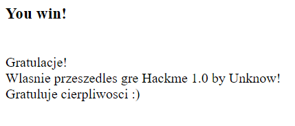

## HackMe2

Link do drugiej części - https://uw-team.org/hm2/ 

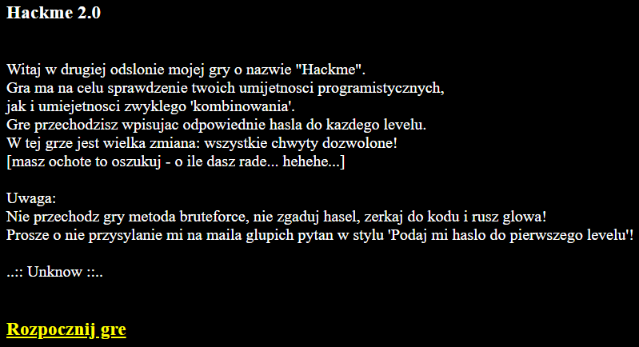

### Poziom 1

Adres: http://www.uw-team.org/hm2/level1.htm

Zrzut ekranu - widzimy na nim pole do logowania.


Przy pomocy skrótu klawiszowego `CTRL+U` można w szybki sposób podejrzeć kod źródłowy strony.

Zawartość strony:

```html
<html><head><title>Hackme 2.0 - by Unknow</title></head><body text="white" bgcolor="black" link="yellow" vlink="yellow" alink="yellow">
<script>
function spr(){
if (document.getElementById('formularz').value==document.getElementById('haslo').value){ self.location.href=document.getElementById('haslo').value+'.htm'; } else {alert('Nie, to nie to haselko :(');}
}
</script>
<h3>Hackme 2.0 - level #1</h3>
Podaj haselko: <input type="password" name="haslo" id="haslo"><input value="text" name="formularz" id="formularz" type="hidden"><input type="button" onClick="spr()" value="Go!">
</body></html>

```

Funkcja `spr` zawiera jeden warunek, który jest weryfikowany - jeśli pole formularza zawiera wartość domyślną zmiennej `value`, to po podaniu jej przechodzimy do dalszego poziomu.

W tym przypadku zmienna `value` znajduje się w `input` o nazwie `formularz` - wartość zmiennej `value` to `text` - czyli po wpisaniu `text` w formularzu, przechodzimy do następnego poziomu.

### Poziom 2

Adres: http://www.uw-team.org/hm2/text.htm

Zrzut ekranu - widzimy na nim pole do logowania.


Przy pomocy skrótu klawiszowego `CTRL+U` można w szybki sposób podejrzeć kod źródłowy strony.

Zawartość strony:

```html

<html><head><title>Hackme 2.0 - by Unknow</title></head><body text="white" bgcolor="black" link="yellow" vlink="yellow" alink="yellow">
<script>
function spr(){
if (document.getElementById('haslo').value==unescape('%62%61%6E%61%6C%6E%65')) { self.location=document.getElementById('haslo').value+'.htm'; } else { alert('Zle haslo!'); }
}
</script>
<h3>Hackme 2.0 - level #2</h3>
Podaj haslo: <input type="password" name="haslo" id="haslo"> <input type="button" onClick="spr()" value="Break me!">
</body></html>

```

W tym przypadku mamy odowałnie do wartości zakodowanej w UTF8. Metoda `unescape()` konwertuje wartość `UTF8` na postać, zrozumiałą dla człowieka. Po zdekodowaniu wartości otrzymujemy słowo `banalne`.

Wpisując wynik dekodowania do formularza, przechodzimy do następnego poziomu.

### Poziom 3

Adres: http://www.uw-team.org/hm2/banalne.htm

Zrzut ekranu - widzimy na nim pole do logowania.


Przy pomocy skrótu klawiszowego `CTRL+U` można w szybki sposób podejrzeć kod źródłowy strony.

Zawartość strony:

```html

<html><head><title>Hackme 2.0 - by Unknow</title></head><body text="white" bgcolor="black" link="yellow" vlink="yellow" alink="yellow">
<script>
function binary(liczba) {
return liczba.toString(2);
}
function spr(){
if (binary(parseInt(document.getElementById('haslo').value))==10011010010) { self.location=document.getElementById('haslo').value+'.htm'; } else { alert('Zle! \nPodstawy matematyki sie klaniaja :)');}
}
</script>
<h3>Hackme 2.0 - level #3</h3>
Podaj haselko: <input type="password" name="haslo" id="haslo"> <input type="button" onClick="spr()" value="Click me baby!">
</body></html>

```

W poziomie 3 posiadamy w kodzie 2 funkcje:
 - `binary()` 
 - `spr()`

Funkcja `binary()` zamienia liczbę w formacie decymalnym na format binarny.
Funkcja `spr()` porównuje podaną wartość zamienioną z wykorzystaniem funkcji `binary()` z liczbą `10011010010` w formacie binarnym. Aby przejść dalej należy podać hasło w formacie decymalnym - czyli należy zamienić wartość `10011010010` do formatu decymalnego.

Przykładowy konwerter online: https://www.rapidtables.com/convert/number/binary-to-decimal.html

Hasło to `1234`.

### Poziom 4

Adres: http://www.uw-team.org/hm2/1234.htm

Zrzut ekranu - widzimy na nim pole do logowania.


Przy pomocy skrótu klawiszowego `CTRL+U` można w szybki sposób podejrzeć kod źródłowy strony.

Zawartość strony:

```html

<!-- FIGE Z MAKIEM DOSTANIESZ, A NIE HASLO! //-->

<html><head><title>Hackme 2.0 - by Unknow</title></head><body text="white" bgcolor="black" link="yellow" vlink="yellow" alink="yellow">
<script>
haslo='';
cos=parseInt(unescape('%32%35%38'));
while ((haslo!=cos.toString(16)) && (haslo!='X') ){
haslo=prompt('podaj haslo:\nwpisz X aby zatrzymac skrypt','');
}
if (haslo==cos.toString(16)) { self.location=haslo+'.php';} else {self.location='http://www.uw-team.org/';}
</script>
<h3>Hackme 2.0 - level #4</h3>
<a href="hehehe.htm">Kliknij mnie :)</a>
</body></html>
```

Podobnie jak w poziomie 3, aby uzyskać hasło, należy zdekodować wartość `UTF8`, zamienić zdekodowany ciąg znaków (`258`) na wartość decymalną (wskazuje na to metoda `parseInt()`), a następnie z wykorzystaniem funkcji `toString(16)` zamień wartość z poprzedniego kroku na format hexadecymalny.

Kluczowe linie kodu:

```js
cos=parseInt(unescape('%32%35%38'));
...
if (haslo==cos.toString(16))
```

Wypunktowane kroki rozwiązania:
 - UTF8 na decymalne - `%32%35%38` -> `258`
 - Decymalne na hexadecymalne - `258` -> `102`

Przykładowe konwertery, dostępne online:
https://www.rapidtables.com/convert/number/decimal-to-hex.html?x=258
https://www.urldecoder.org 

Aby przejść dalej należy wpisać wartość `102` w formularzu.

### Poziom 5

Adres: http://www.uw-team.org/hm2/102.php

Zrzut ekranu - widzimy na nim pole do logowania oraz ujawniony kod PHP.

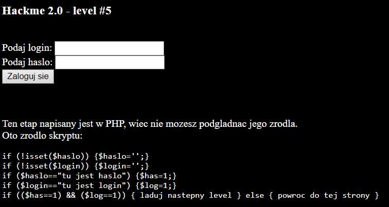

Przy pomocy skrótu klawiszowego `CTRL+U` można w szybki sposób podejrzeć kod źródłowy strony.

Zawartość strony:

```html
<html><head><title>Hackme 2.0 - by Unknow</title></head><body text="white" bgcolor="black" link="yellow" vlink="yellow" alink="yellow">
<h3>Hackme 2.0 - level #5</h3>
<form action="" method="get">
<br>Podaj login: <input type='text' name='login'>
<br>Podaj haslo: <input type='password' name='haslo'>
<br><input type="submit" value='Zaloguj sie'>
</form>
<br><br>Ten etap napisany jest w PHP, wiec nie mozesz podgladnac jego zrodla.
<br>Oto zrodlo skryptu:<br>
<code>
<br>if (!isset($haslo)) {$haslo='';}
<br>if (!isset($login)) {$login='';}
<br>if ($haslo=="tu jest haslo") {$has=1;}
<br>if ($login=="tu jest login") {$log=1;}
<br>if (($has==1) && ($log==1)) { laduj nastepny level } else { powroc do tej strony }
</code>
</body></html>
```

W tym poziomie operujemy na publicznie przedstawionym skrypcie napisanym w PHP. Poprzez przekazanie w żądaniu HTTP parametrów login `log` oraz hasło `has` możemy przejść do następnego poziomu.

Język PHP pozwala na wstawienie wartości zmiennych w trakcie przekazywania żądania w adresie strony jako parametry.
Przekazane tak parametry będą wiążące.
Jeśli w żądaniu przekażemy na raz wartość 1 dla pola `has` i `log`, przejdziemy do następnego poziomu.

Można to wykonać poprzez wykonanie takiego zapytania:

http://www.uw-team.org/hm2/102.php?log=1&has=1 

Po wykonaniu żądania HTTP, zostajemy przekierowani na kolejną stronę, która odsyła nas do kolejnego poziomu.


### Poziom 6

Adres: http://www.uw-team.org/hm2/url.php

Zrzut ekranu - widzimy na nim informacje o ciasteczku z wróżbą.


Przy pomocy skrótu klawiszowego `CTRL+U` można w szybki sposób podejrzeć kod źródłowy strony.

Zawartość strony:
```html
<html><head><title>Hackme 2.0 - by Unknow</title></head><body text="white" bgcolor="black" link="yellow" vlink="yellow" alink="yellow">
<h3>Hackme 2.0 - level #6</h3>
Dalem ci ciasteczko z wrozba :)
<br>Przeczytaj wrozbe :)
</body></html>
```

Autor wyzwania sugeruje, aby odczytać tzw. `cookies` (`ciasteczko`) na stronie. Podczas komunikacji z aplikacjami webowymi, wykorzystywane są ciasteczka, głównie aby utrzymywać sesję np. logowania, ale i również do przechowywania stałych zmiennych (np. adresu e-mail, wypełnianego w formularzu na witrynie).

Aby sprawdzić otrzymane ciasteczko należy uruchomić w przeglądarce `narzędzia deweloperskie`, następnie przejść do zakładki `Application>Cookies`.

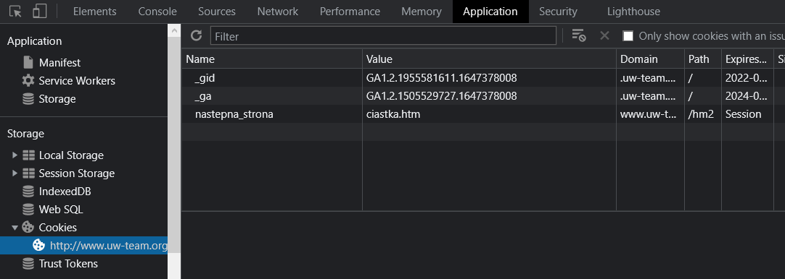

Po weryfikacji widzimy, że wartość ciastka `nastepna_strona` to `ciastka.htm`.

Po wpisaniu w pasku przeglądarki:
http://www.uw-team.org/hm2/ciastka.htm

Przechodzimy do poziomu 7.

Również przy pomocy komendy `curl`, można uzyskać w prosty sposób z nagłówka odpowiedzi na nasze żądanie HTTP informacje o ciasteczkach (pole `Set-Cookie`):

Komenda:

```bash
curl --head http://www.uw-team.org/hm2/url.php
```

Odpowiedź serwera WWW:

```bash
tacola@DESKTOP-02SAKPD:/mnt/c/Users/Tacola$ curl --head http://www.uw-team.org/hm2/url.php
HTTP/1.1 200 OK
Date: Tue, 15 Mar 2022 21:43:21 GMT
Content-Type: text/html; charset=UTF-8
Connection: keep-alive
Set-Cookie: nastepna_strona=ciastka.htm
CF-Cache-Status: DYNAMIC
Report-To: {"endpoints":[{"url":"https:\/\/a.nel.cloudflare.com\/report\/v3?s=pOd4fV80pPtexXjo6fkM1iD8kkvyCJ%2BluSbRMiPRECMFi58NBevIp7ZqgjYBNGGYmL%2BJ6xrDUakhqC6Lmkz5oPxssHtaYdct0Y97ZJP7x3nLxJCVMIF8PLGBtU8%2BRCiDe60%3D"}],"group":"cf-nel","max_age":604800}
NEL: {"success_fraction":0,"report_to":"cf-nel","max_age":604800}
Server: cloudflare
CF-RAY: 6ec86c99eef36d8f-MUC
alt-svc: h3=":443"; ma=86400, h3-29=":443"; ma=86400
```

### Poziom 7

Adres: http://www.uw-team.org/hm2/ciastka.htm

Zrzut ekranu - widzimy na nim pole do logowania.

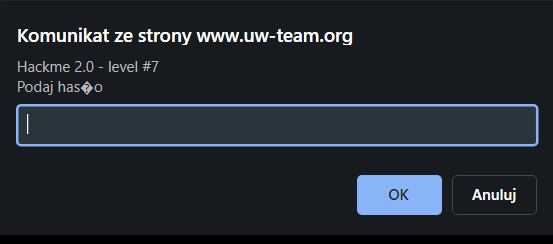

Przy pomocy skrótu klawiszowego `CTRL+U` można w szybki sposób podejrzeć kod źródłowy strony.

Zawartość strony:
```html

<html><head><title>Hackme 2.0 - by Unknow</title></head><body text="white" bgcolor="black" link="yellow" vlink="yellow" alink="yellow">
<script>
strona='zle.htm';
haslo=prompt("Hackme 2.0 - level #7 \nPodaj has�o","") 
document.write('<script type="text/javascript" src="include/'+haslo+'.js"><\/script>'); 
onload=function(){ 
if(haslo==null) { self.location='http://www.uw-team.org/' } else location.href=strona; }
</script>
</body></html>
```

Po wpisaniu hasła przez użytkownika, kod strony ładuje skrypt JavaScript o podanej nazwie (jak zmienna `haslo`) ze ścieżki `/include`. 
Wskazuje to na popularny błąd `Directory Listing`. Polega on na tym, że użytkownik może przeglądać ścieżki, do których nie powinien mieć dostępu.

Wchodząc na adres http://www.uw-team.org/hm2/include/ widzimy nazwę dołączanego skryptu JavaScript, którego nazwa wskazuje na hasło.

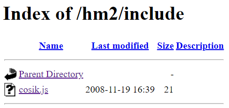


Po wpisaniu hasła - `cosik`, przechodzimy do następnego poziomu.

### Poziom 8

Adres: http://www.uw-team.org/hm2/listing.php

Zrzut ekranu - widzimy na nim komunikat.


Przy pomocy skrótu klawiszowego `CTRL+U` można w szybki sposób podejrzeć kod źródłowy strony.

Zawartość strony:

```html

<html><head><title>Hackme 2.0 - by Unknow</title></head><body text="white" bgcolor="black" link="yellow" vlink="yellow" alink="yellow">
<script>
// Prymitywne zabezpieczenie :)
if (document.referrer!="https://www.onet.pl/") {alert('Aby wejsc na ta strone referentem musi byc www.onet.pl (strona wywolujaca)'); location.href="http://www.uw-team.org/";}
function spr(){
}
</script>
<script>
function pokazukryj(stan){
if (stan==1) {ukryte.style.display="block";} else {ukryte.style.display="none";}
}
</script>
<h3>Hackme 2.0 - level #8</h3>
<form action="listing.php">
<br>Podaj haslo: <input type="password" name="haslo"><input type="submit" value="Let's rock!">
</form>
<br><br>
<div id="ukryte" style="display:none">
<font color="black">h</font><font color="black">a</font><font color="black">s</font><font color="black">l</font><font color="black">e</font><font color="black">m</font><font color="black"> d</font>
<font color="black">o</font><font color="black"> t</font><font color="black">e</font><font color="black">g</font><font color="black">o </font><font color="black">e</font><font color="black">t</font><font color="black">a</font><font color="black">p</font><font color="black">u</font><font color="black"> j</font>
<font color="black">e</font><font color="black">s</font><font color="black">t</font><font color="black"> s</font><font color="black">l</font><font color="black">o</font><font color="black">w</font><font color="black">o </font><font color="black">k</font><font color="black">x</font><font color="black">n</font><font color="black">x</font><font color="black">g</font><font color="black">x</font><font color="black">n</font><font color="black">x</font><font color="black">a</font></div>
</body></html>

```

Autor wyzwania zasugerował, że żeby uzyskać dostęp do panelu logowania, należy w polu `Referer`, przy żądaniu HTTP przedstawić się jako https://www.onet.pl/.

Jednakże godnym uwagi jest umieszczony na końcu strony "ukryty" `div` (`<div id="ukryte" style="display:none">`). W nim znajduje się zobfuskowany (zaciemniony, aby trudno było go zrozumieć gołym okiem) kod, który ukrywa swoją zawartość przed użytkownikem.

Po oczyszczeniu zbędnych odwołań do koloru czcionki (`<font color="black">` oraz `</font>`):

```html
<div id="ukryte" style="display:none">
haslem d
o tego etapu j
est slowo kxnxgxnxa</div>
```

Otrzymujemy hasło - `kxnxgxnxa`.

Teraz wystarczy tylko wysłać spreparowane żądanie HTTP z polem `Referer` https://www.onet.pl oraz parametrem `haslo=kxngxnxa`.

Można to w prosty sposób zrobić przy pomocy komendy curl, wykonanej w wierszu poleceń w systemie Linux:

```bash
curl -e 'https://www.onet.pl/' www.uw-team.org/hm2/listing.php -d 'haslo=kxnxgxnxa'
```

Flaga `-e` ustawia wartość pola `referer`, a flaga `-d` przekazuje konkretny parametr w zapytaniu.

Dzięki wykonaniu zmodyfikowanego żądania otrzymujemy odpowiedź HTTP:

```html
<html><head><title>Hackme 2.0 - by Unknow</title></head><body text="white" bgcolor="black" link="yellow" vlink="yellow" alink="yellow">
Nastepny etapik ukryty jest w pliku pokaz.php<script>
function pokazukryj(stan){
if (stan==1) {ukryte.style.display="block";} else {ukryte.style.display="none";}
}
</script>
<h3>Hackme 2.0 - level #8</h3>
<form action="listing.php">
<br>Podaj haslo: <input type="password" name="haslo"><input type="submit" value="Let's rock!">
</form>
<br><br>
<div id="ukryte" style="display:none">
<font color="black">h</font><font color="black">a</font><font color="black">s</font><font color="black">l</font><font color="black">e</font><font color="black">m</font><font color="black"> d</font>
<font color="black">o</font><font color="black"> t</font><font color="black">e</font><font color="black">g</font><font color="black">o </font><font color="black">e</font><font color="black">t</font><font color="black">a</font><font color="black">p</font><font color="black">u</font><font color="black"> j</font>
<font color="black">e</font><font color="black">s</font><font color="black">t</font><font color="black"> s</font><font color="black">l</font><font color="black">o</font><font color="black">w</font><font color="black">o </font><font color="black">k</font><font color="black">x</font><font color="black">n</font><font color="black">x</font><font color="black">g</font><font color="black">x</font><font color="black">n</font><font color="black">x</font><font color="black">a</font></div>
</body></html>
```

Aby przejść do następnego poziomu, należy przejść do pliku pokaz.php - zgodnie z opisem pozostawionym w źródle strony.

### Poziom 9

Adres: http://www.uw-team.org/hm2/pokaz.php

Zrzut ekranu - widzimy na nim komunikat.


Zawartość strony:

```html

<html><head><title>Hackme 2.0 - by Unknow</title></head><body text="white" bgcolor="black" link="yellow" vlink="yellow" alink="yellow">
<script>
var now = new Date();
var godzina = now.getHours();
var minuta = now.getMinutes();
if ((godzina>23) && (minuta>55)) {
} else { alert('Dostep do tej strony mozliwy jest jedynie po godzinie 1 w nocy! \nObejdz to jakos :)'); self.location='http://www.uw-team.org/';}
</script>
<h3>Hackme 2.0 - level #9</h3>
<!-- Widze ze zrodlo juz masz... albo je sciagnales, albo przestawiles sobie godzine na komputerze ;) //-->
<font color="lime"><pre>01100111 01110010 01100001 01110100 01110101 01101100 01100001 01100011 01101010 01100101 00100001 00100000 01110101 01100100 01100001 11000101 10000010 01101111 00100000 01000011 01101001 00100000 01110011 01101001 11000100 10011001 00100000 01110101 01101011 01101111 11000101 10000100 01100011 01111010 01111001 11000100 10000111 00100000 01110100 01100101 00100000 01110111 01100101 01110010 01110011 01101010 01100101 00100000 01001000 01100001 01100011 01101011 01101101 01100101 00101110
</pre></font>
<br>Milego dekodowania :)
</body></html>

```

Po przejściu na stronę jest od razu widoczna informacja o dostępności witryny dopiero po 1 w nocy, jednakże szybki skrót klawiszowy `CTRL + U` wystarczy, aby uzyskać kod źródłowy strony.

W źródle strony, w `<pre>` znajduje się ciąg binarny do zdekodowania.

Przykładowy konwerter online: https://www.rapidtables.com/convert/number/binary-to-ascii.html

Po zdekodowaniu otrzymujemy ciąg znaków:

```html
gratulacje! udało Ci się ukończyć te wersje Hackme.
```

W ten oto sposób udało się przejść HackMe2.